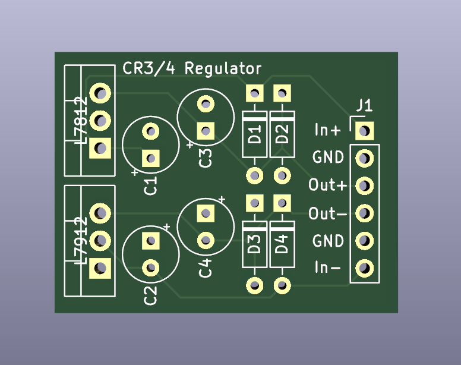

# Power Regulator for CR3 / CR4

This pcb is designed to replace voltage regulator on Mackie CR3 / CR4 as described in [this writeup](https://www.mikrocontroller.net/articles/Mackie_Creative_Reference_CR3_CR4_Reparatur_Repair).

## BOM
|QTY    |Part                           |Recommended part number    |
|-------+-------------------------------+---------------------------|
|4      |.1uf capacitor                 |K104K20X7RK53H5G           |
|4      |diode                          |1n4148                     |
|1      |Voltage Regulator (positive)   |L7812ABV                   |
|1      |Voltage Regulator (negative)   |L7912ACV                   |
